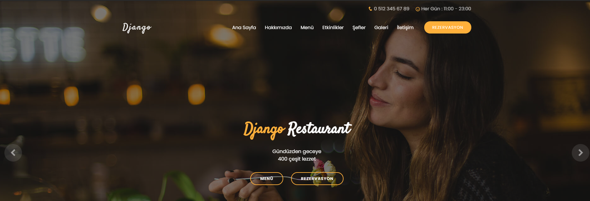

# Restaurant
Django ile yapılan restaurant projesi


# Django framework ile yapılan restaurant sitesi

:+1:  Django ile kodlanmış restaurant sitesidir.

  - Bu projede restaurant sitesine ait hakkımızda, etkinlikler,menü,şefler,galeri,iletişim ve rezervasyon  sayfaları vardır.



## Kurulum 
------
Projeyi indirdikten sonra sırayla aşağıdaki adımları yapınız:

```
python manage.py makemigrations
python manage.py migrate
```

#### Admin Panelinde Giriş yapmak için;
```
python manage.py createsuper
```

#### Web Sunucusunda Başlatmak için;
```
python manage.py runserver
```

